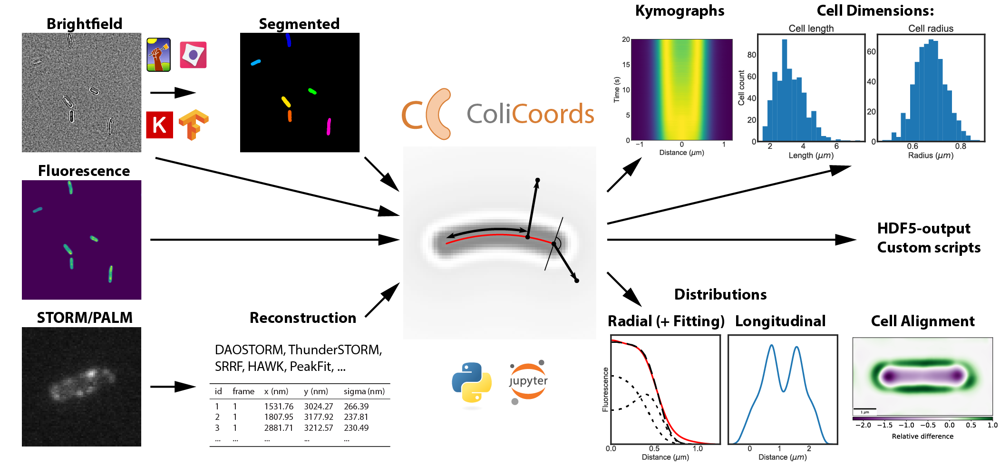

|travis| |appveyor| |docs| |binder| |codecov| |license| |doi| 

|test|

.. |travis| image:: https://travis-ci.org/Jhsmit/ColiCoords.svg?branch=master
    :target: https://travis-ci.org/Jhsmit/ColiCoords 
.. |appveyor| image:: https://ci.appveyor.com/api/projects/status/801teey9fnm8kuc9?svg=true
    :target: https://ci.appveyor.com/project/Jhsmit/colicoords
.. |docs| image:: https://readthedocs.org/projects/colicoords/badge/?version=latest
    :target: https://colicoords.readthedocs.io/en/latest/?badge=latest
    :alt: Documentation Status
.. |binder| image:: https://mybinder.org/badge_logo.svg 
    :target: https://mybinder.org/v2/gh/Jhsmit/ColiCoords/master
.. |codecov| image:: https://codecov.io/gh/Jhsmit/ColiCoords/branch/master/graph/badge.svg
  :target: https://codecov.io/gh/Jhsmit/ColiCoords
.. |license| image:: https://img.shields.io/badge/License-MIT-yellow.svg
    :target: https://opensource.org/licenses/MIT
.. |doi| image:: https://zenodo.org/badge/92830488.svg
   :target: https://zenodo.org/badge/latestdoi/92830488

Preliminary docs: https://colicoords.readthedocs.io/

Project Goals
=============

ColiCoords is a python project for analysis of fluorescence microscopy data from rodlike cells. The project is aimed to be an open, well documented platform where users can easily share data through compact hdf5 files and analysis pipelines in the form of Jupyter notebooks.

Installation
============

``ColiCoords`` is available on PyPi and Conda Forge. Currently, python >= 3.6 is required.

Installation by `Conda <https://conda.io/docs/>`_.:

.. code:: bash
     
     conda install -c conda-forge colicoords 

For installation via PyPi a C++ compiler is required for installing the dependency `mahotas  <https://mahotas.readthedocs.io/en/latest/index.html>`_. Alternatively, ``mahotas`` can be installed separately from Conda. 

To install ``ColiCoords`` from pypi:

.. code:: bash

    pip install colicoords

Although `ColiCoords` features automated testing, there are likely to be bugs. Users are encouraged to report them via the Issues page on GitHub. 

Contact: jhsmit@gmail.com

Examples
========

Several examples of `ColiCoords` usage can be found in the examples directory.

|pipeline|

