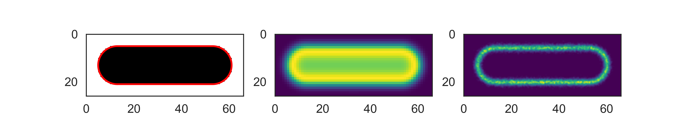

Aligning Cells
==============

The relative coordinates and associated data of every ``Cell`` object can be transformed in order to spatially align and
overlap a set of measured cells. To do so, a cell with desired dimensions is generated first:

.. code-block::python

    from colicoords import SynthCell
    model_cell = SynthCell(40, 8, 1e-5)

This model cell is used as a reference for alignment of a set of cells.

.. code-block:: python

    from colicoords import load, align_cells
    cells = load('data/03_synthetic_cells.hdf5')
    aligned = align_cells(model_cell, cells, r_norm=True, sigma=1)

The return value is a copy of ``model_cell`` where all aligned data elements from ``cells`` has been added. When the boolean
``r_norm`` keyword argument is set to ``True``, the cells radial coordinate are normalized by using the current value of
``r`` in their coordinate system.

To align image-based data elements (fluorescence, brightfield) all pixel coordinates of all images are transformed to the
model cell's coordinate system. The resulting point cloud is then convoluted with a gaussian kernel where the size of the
kernel is determined by the ``sigma`` parameter.

Localization-based data elements (storm) are aligned by transforming all localization parameters to the model cell's
coordinate system and then combining all localizations in one data element.

Data elements can be aligned individually by using the function ``align_data_element``.

The final result of the alignment of this dataset can be visualized by:

.. code-block:: python

    from colicoords import CellPlot
    cp = CellPlot(aligned_cell)
    fig, axes = plt.subplots(1, 3, figsize=(8, 1.5))
    cp.imshow('binary', ax=axes[0])
    cp.plot_outline(ax=axes[0])
    cp.imshow('fluorescence', ax=axes[1])
    cp.plot_storm(method='gauss', ax=axes[2], upscale=10)

The above block of code takes about 10 minutes to render the STORM image on a typical CPU due to the large amount of
localizations (>35k) and pixel upscale factor used.

