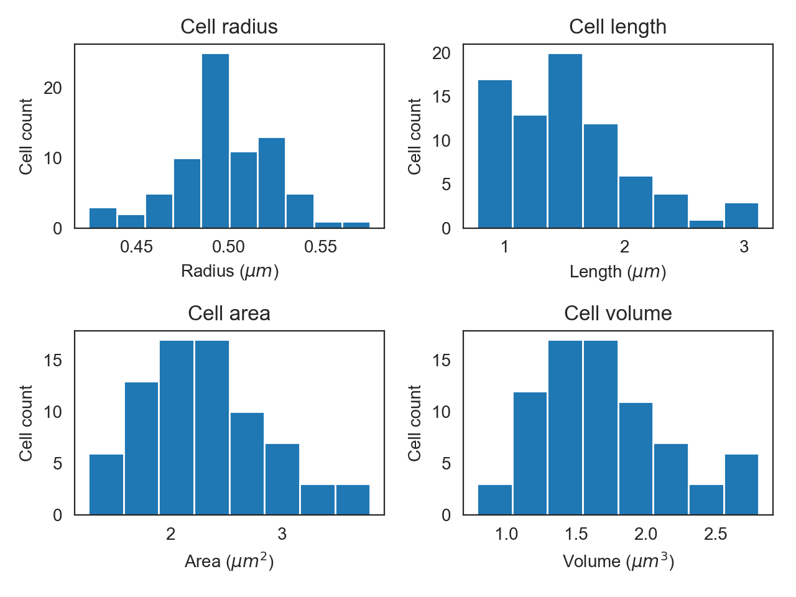
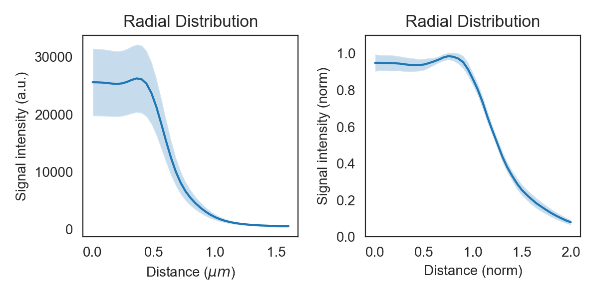

Batch Processing
================

``ColiCoords`` provides utility functions to easily convert stacks of images of cells optionally together with 
single-particle localization data (STORM). Binary images of the cells are required to identify the cells positions as 
well as to determine their orientation to horizontally align the cells. All preprocessing on input data such as background
correction, flattening, alignment or drift correction needs to be done before the data is input into ``ColiCoords``.

The segmentation process to generate binary images does not need to be done with high accuracy since the binary is only 
used to identify the position and calcuate initial guesses for the coordinate system. Optimization of the coordinate 
system can be done in a second step based on other input images (e.g. brightfield or STORM/PAINT membrane marker). 

The segmentation can be done via classical methods such as thresholding and watershedding or though cell-analysis 
software such as CellProfiler_ or Ilastik_. In the `CNN` module of `ColiCoords` provides the user with a Keras/Tensorflow
implementation the the `U-Net`_ convolutional neural network architecture :cite:`1505.04597`. The networks are fast an 
robost and allow for high-troughput segmentation (>10 images/second) on consumer level graphics cards. Example notebooks 
can be found in the examples directory with implementations of training and applying these neural networks. 

Making a Data object
--------------------

After preprocessing and segmentation, the data can be input into `ColiCoords`. This is again handled by the 
:class:`~colicoords.data_models.Data` object. Images are added as :class:`~numpy.ndarray` whose shape should be identical. 
STORM data is input as Structured Arrays (see also :doc:`storm_data`).

A :class:`~colicoords.data_models.Data` object can be prepares as follows:

.. code-block:: python

    import tifffile
    from colicoords import Data, data_to_cells

    binary_stack = tifffile.imread('data/02_binary_stack.tif')
    flu_stack = tifffile.imread('data/02_brightfield_stack.tif')
    brightfield_stack = tifffile.imread('data/02_fluorescence_stack.tif')

    data = Data()
    data.add_data(binary_stack, 'binary')
    data.add_data(flu_stack, 'fluorescence')
    data.add_data(brightfield_stack, 'brightfield')

The :class:`~colicoords.data_models.Data` class supports iteration and Numpy-like indexing. This indexing capability is 
used by the helper function :func:`~colicoords.preprocessing.data_to_cells` to cut individual cells out of the data 
across all data channels. Every cell is then oriented horizontally based on the image moments in the binary image (as default).
A name attribute is assigned based on the image the cell originates from and the label in the binary image, ie
A :class:`~colicoords.cell.Cell` object is initialized together with its own coordinate system and placed in an instance of
:class:`~colicoords.cell.CellList`. This object is a container for :class:`~colicoords.cell.Cell` objects and supports 
Numpy-like indexing and allows for batch operations to be done on all cells in the container.

To generate :class:`~colicoords.cell.Cell` objects from the data and to subsequently optimize all cells' coordinate 
systems:

Cell objects and optimization
-----------------------------

.. code-block:: python

    cell_list = data_to_cells(data)
    cell_list.optimize('brightfield')
    cell_list.measure_r('brightfield', mode='mid')

High-performance computing is supported for timely optimizing many cell object though calling :func:`~colicoords.cell.CellList.optimize_mp` (see :doc:`optimization`). 

The returned :class:`~colicoords.cell.CellList` object is basically an :class:`~numpy.ndarray` of :class:`colicoords.cell.Cell` objects. Many of the single-cell attributes can be accessed which are returned in the form of a list or array for the whole set of cells. 

Plotting
--------

:class:`~colicoords.plot.CellListPlot` can be used to easily plot fluorescence distribution of the set of cells or histogram certain properties.

.. code-block:: python

    from colicoords import CellListPlot

    clp = CellListPlot(cell_list)
    fig, axes = plt.subplots(2, 2)
    clp.hist_property(ax=axes[0,0], tgt='radius')
    clp.hist_property(ax=axes[0,1], tgt='length')
    clp.hist_property(ax=axes[1,0], tgt='area')
    clp.hist_property(ax=axes[1,1], tgt='volume')
    plt.tight_layout()

When using :class:`~colicoords.cell.CellList` the function :func:`~colicoords.cell.CellList.r_dist` returns the radial distributions of all cells in the list. 

.. code-block:: python

    x, y = cell_list.r_dist(20, 1)

Here, the arguments given are the `stop` and `step` parameters for the x-axis, respectively. The returned `y` is an array
where each row holds the radial distribution for a given cell. 

To plot the radial distributions via :class:`~colicoords.plot.CellListPlot`:

.. code-block:: python

    f, axes = plt.subplots(1, 2)
    clp.plot_r_dist(ax=axes[0])
    axes[0].set_ylim(0, 35000)
    clp.plot_r_dist(ax=axes[1], norm_y=True, norm_x=True)
    plt.tight_layout()

The band around the line shows the sample's standard deviation. By normalizing each curve on the y-axis variation in
absolute intensity is eliminated and the curve shows only the shape and its standard deviation. Normalization on the x-axis
sets the radius measured by the brightfield in the previous step to one, thereby eleminating cell width variations.

.. _CellProfiler: http://http://cellprofiler.org/
.. _Ilastik: http://ilastik.org/
.. _`U-Net`: https://lmb.informatik.uni-freiburg.de/people/ronneber/u-net/

.. bibliography:: refs.bib