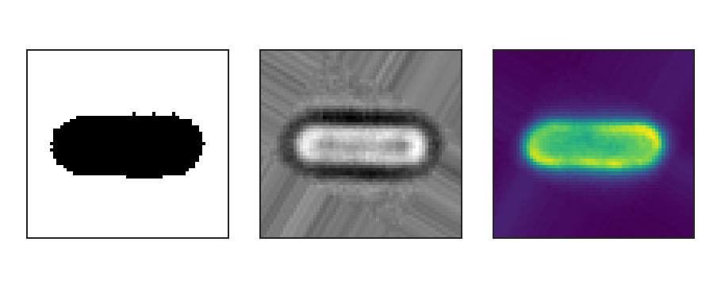
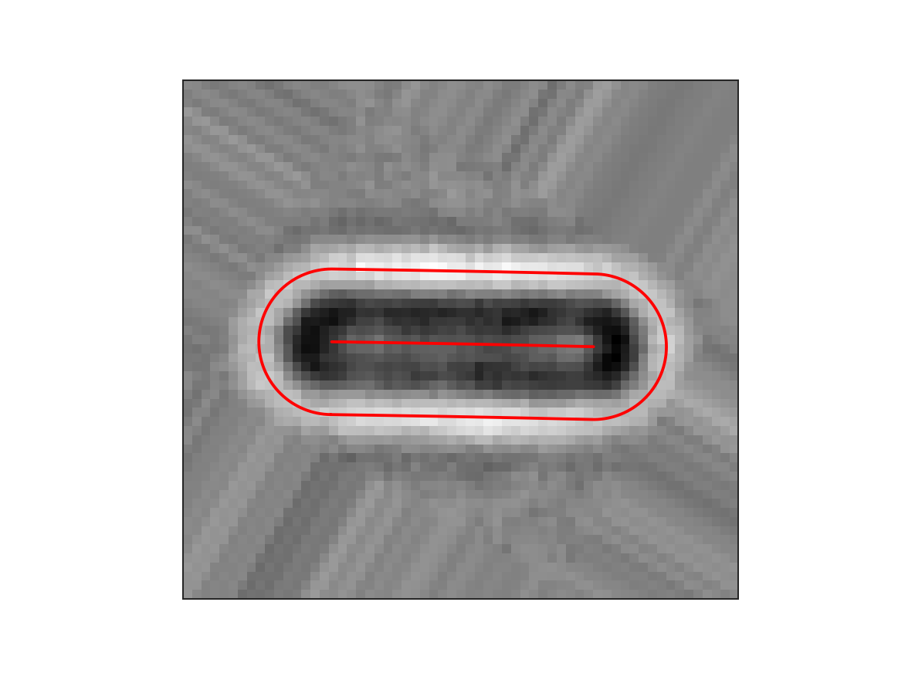
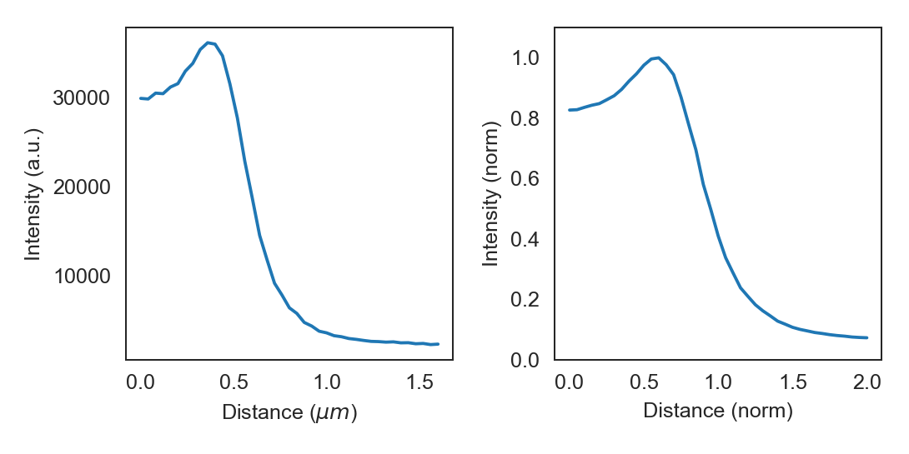

Introduction
=============

ColiCoords is a python project aimed to make analysis of fluorescence microscopy data from rodlike cells more streamlined
and intuitive. These goals are achieved by describing the shape of the cell by a 2nd degree polynomial, and this simple
mathematical description together with a data structure to organize cell data on a single cell basis allows for
straightforward and detailed analysis.

Using ColiCoords
----------------

The basic princlples of `ColiCoords` will first be demonstrated with a simple example. We start out with a binary, 
brightfield and fluorescence image of a horizontally oriented cell. To turn this data into a 
:class:`~colicoords.cell.Cell` object we need to first create a :class:`~colicoords.data_models.Data` class and use the 
:func:`~colicoords.data_models.Data.add_data` method to add the images as an :class:`~numpy.ndarray`, as well as indicate the data class (binary, brightfield, fluorescence or storm). This data interally within the :class:`~colicoords.cell.Cell` object as well as to initialize it.

Binary (left), brightfield (middle) and fluorescence (right) input images.

.. code-block:: python

  import tifffile
  from colicoords import Data, Cell

  binary_img = tifffile.imread('data/01_binary.tif')
  brightfield_img = tifffile.imread('data/01_brightfield.tif')
  fluorescence_img = tifffile.imread('data/01_fluorescence.tif')

  data = Data()
  data.add_data(binary_img, 'binary')
  data.add_data(brightfield_img, 'brightfield')
  data.add_data(fluorescence_img, 'fluorescence', name='flu_514')

  cell = Cell(data)

The :py:class:`~colicoords.cell.Cell` object has two main attributes: :attr:`~colicoords.cell.Cell.data` and :attr:`~colicoords.cell.Cell.coords`. The :attr:`~colicoords.data_models.Data.data_dict` attribute is 
the instance of :class:`~colicoords.data_models.Data` used to initialize the ``Cell`` object and holds all images as
:class:`~numpy.ndarray` subclasses in the attribute :attr:`~colicoords.data_models.Data.data_dict`. The 
:attr:`~colicoords.cell.Cell.coords` attribute is an instance of :class:`~colicoords.cell.Coordinates` and is used to optimize the cell's coordinate system and perform
related calculations. The coordinate system described by a polynomial of second degree and together with left and right
bounds and the radius of the cell they parameterize the coordinate system. These values are first initial guesses based 
on the binary image but can be optimized iteratively:

.. code-block:: python

  cell.optimize()

More details on optimization of the coordinate system can be found in the section :doc:`optimization`. The cells 
coordinate system allows for the conversion of carthesian input coordinates to be transformed to cell coordinates. The
details of the coordinate system and applications are described in section :doc:`coords`. 

Plotting radial distributions
-----------------------------

In this section we will go over an example of plotting the radial distribution of the input fluorescence image. 
``ColiCoords`` can plot distribution of signals from both image or localization-based (see also :doc:`storm_data`) data 
along both the longitudinal or radial axis. 

.. code-block:: python

  from colicoords.plot import CellPlot
  import matplotlib.pyplot as plt

  cp = CellPlot(cell)

  plt.figure()
  cp.imshow('flu_514', cmap='viridis', interpolation='nearest')
  cp.plot_outline()
  cp.plot_midline()
  plt.show()

.. figure:: figures/introduction_coordinates_initial.png
  :scale: 25 %

  Brightfield image with cell midline and outline.

This shows the brightfield image together with the cell outline and midline optimized from the binary image, which was 
derived from the brightfield image. As can be seen the coordinate system does not completely match the fluorescence image of the cell. This is because the binary image is only a crude estimation of the actual cell position and shape. The coordinate system 
can be optimize based on the brightfield image to refine the coordinate system. Other input data channels (fluorescence, storm) can be used as described in the section :doc:`optimization`. 

.. code-block:: python

  cell.optimize('brightfield')
  cell.measure_r('brightfield', mode='min')

Here, the first line optimizes the coordinate system to match the shape of the cell as its measured in the brightfield image
through an iterative bootstrapping process. Then, in the second line, the radius of the cell is determined from the 
brightfield image. The keyword argument `mode='min'` indicates that in this case the radius of the cell is defined as where 
the pixel values on the radial distribution are minimum. Note that this value for the radius is not used in transforming
coordinates from carthesian to cell coordinates but only in geometrical properties such as cell area or volume. This gives 
the following result:

Brightfield image with optimized coordinate system.

To plot the radial distribution of the ``flu_514`` fluorescence channel:

.. code-block:: python

  f, (ax1, ax2) = plt.subplots(1, 2)
  cp.plot_r_dist(ax=ax1)
  cp.plot_r_dist(ax=ax2, norm_x=True, norm_y=True)
  plt.tight_layout()

Radial distribution curve of fluorescence as measured (left) and normalized (right).

The displayed curve is constructed by calcuating the radials distance for every the (x, y) coordinates pair for each pixels.
The final curve is calculated from all datapoints by smoothing with a gaussian kernel. 

basically a histogram of mean intensity of all fluorescence pixels binned by their distance from
the cell midline. When using the :meth:`~colicoords.plot.CellPlot.plot_r_dist` method on :class:`~colicoords.plot.CellPlot` the bin size is chosen 
automatically as defined in the config. The x-axis (distance) is converted from pixels (which is used internally) to 
physical distance by the converstion factor as defined in the config (default is 80 nm).

It is also possible to directly access the data from the :class:`~colicoords.cell.Cell` object by calling :class:`~colicoords.cell.Cell.r_dist`. The radial distribution curves can be normalized in both ``x`` and ``y`` directions. 
When normalized in the ``x`` direction the radius obtained from the brightfield image is set to one, thereby eliminating 
cell-to-cell variations in width.